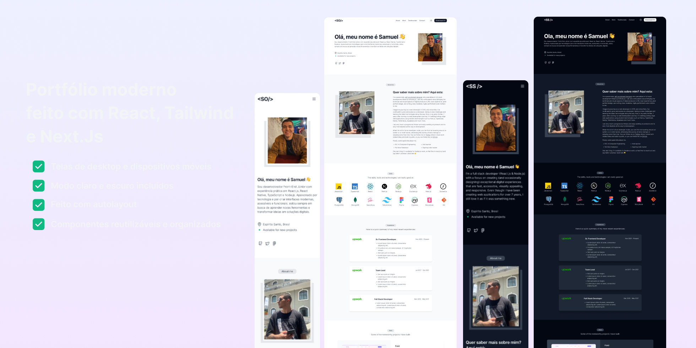

# Samuel Oliveira | [Portfólio](https://portfolio-samuel-oliveira.vercel.app/pt)



Este é um projeto de portfólio pessoal desenvolvido com [Next.js](https://nextjs.org/), [React](https://react.dev/), [TypeScript](https://www.typescriptlang.org/) e [Tailwind CSS](https://tailwindcss.com/). O objetivo é apresentar minhas habilidades, experiências e projetos de forma moderna, responsiva e acessível.

## ✨ Funcionalidades

- Página inicial com apresentação e foto
- Seção "Sobre mim" detalhada
- Listagem de habilidades técnicas
- Experiências profissionais recentes
- Links para redes sociais e informações de contato
- Download de currículo em PDF
- Suporte a tema claro/escuro (dark mode)
- Suporte a português e inglês (i18n)

## 🚀 Tecnologias Utilizadas

- [Next.js](https://nextjs.org/)
- [React](https://react.dev/)
- [TypeScript](https://www.typescriptlang.org/)
- [Tailwind CSS](https://tailwindcss.com/)
- [Radix UI](https://www.radix-ui.com/)
- [Lucide Icons](https://lucide.dev/)
- [React Icons](https://react-icons.github.io/react-icons/)
- [Shadcn/UI](https://ui.shadcn.com/)

## 📦 Instalação

1. Clone o repositório:

   ```sh
   git clone https://github.com/seu-usuario/portfolio.git
   cd portfolio
   ```

2. Instale as dependências:

   ```sh
   npm install
   # ou
   yarn install
   ```

3. Rode o projeto em modo de desenvolvimento:

   ```sh
   npm run dev
   # ou
   yarn dev
   ```

4. Acesse em [http://localhost:3000](http://localhost:3000)

## 🛠️ Scripts Disponíveis

- `dev`: Inicia o servidor de desenvolvimento
- `build`: Gera a build de produção
- `start`: Inicia o servidor em produção
- `lint`: Executa o linter

## 📁 Estrutura de Pastas

- `src/app/` — Páginas e seções principais do site
- `src/components/` — Componentes reutilizáveis (UI, cards, header, footer, etc)
- `public/` — Imagens e arquivos estáticos (ex: currículo PDF)
- `src/lib/` — Funções utilitárias

## 📄 Licença

Este projeto é open-source e está sob a licença [MIT](LICENSE).

---

Projetado por [Sagar Shah](https://github.com/shahsagarm) e Desenvolvido com 💙 por [Samuel Oliveira](https://github.com/samueloliveiraa)

---

# Samuel Oliveira | Portfolio


This is a personal portfolio project developed with [Next.js](https://nextjs.org/), [React](https://react.dev/), [TypeScript](https://www.typescriptlang.org/) and [Tailwind CSS](https://tailwindcss.com/). The goal is to showcase my skills, experiences, and projects in a modern, responsive, and accessible way.

## ✨ Features

- Home page with introduction and photo
- Detailed "About Me" section
- List of technical skills
- Recent professional experiences
- Links to social networks and contact information
- Downloadable resume in PDF
- Light/dark mode support
- Support for Portuguese and English (i18n)

## 🚀 Technologies Used

- [Next.js](https://nextjs.org/)
- [React](https://react.dev/)
- [TypeScript](https://www.typescriptlang.org/)
- [Tailwind CSS](https://tailwindcss.com/)
- [Radix UI](https://www.radix-ui.com/)
- [Lucide Icons](https://lucide.dev/)
- [React Icons](https://react-icons.github.io/react-icons/)
- [Shadcn/UI](https://ui.shadcn.com/)

## 📦 Installation

1. Clone the repository:

   ```sh
   git clone https://github.com/your-user/portfolio.git
   cd portfolio
   ```

2. Install the dependencies:

   ```sh
   npm install
   # ou
   yarn install
   ```

3. Run the project in development mode:

   ```sh
   npm run dev
   # ou
   yarn dev
   ```

4. Access at [http://localhost:3000](http://localhost:3000)

## 🛠️ Available Scripts

- `dev`: Starts the development server
- `build`: Builds the project for production
- `start`: Starts the production server
- `lint`: Runs the linter

## 📁 Folder Structure

- `src/app/` — Main pages and sections of the site
- `src/components/` — Reusable components (UI, cards, header, footer, etc)
- `public/` — Images and static files (e.g., resume PDF)
- `src/lib/` — Utility functions

## 📄 License

This project is open-source and licensed under the MIT [MIT](LICENSE) license.

---

Designed by [Sagar Shah](https://github.com/shahsagarm) and developed with 💙 by [Samuel Oliveira](https://github.com/samueloliveiraa)
